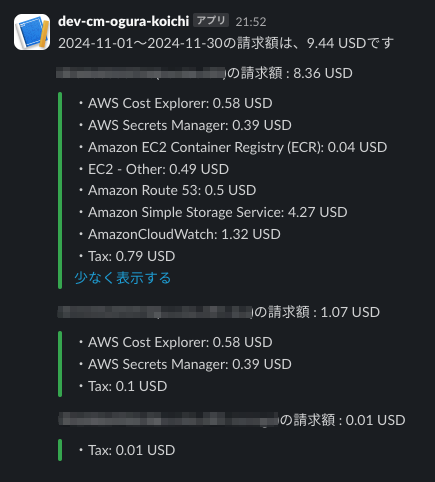

# aws-org-cost-notify

マルチアカウントのAWS環境で、管理アカウント上で実行することで、配下のアカウントを含めた料金通知を行います。

```
<accountId>(<description>)の請求額: 9.99 USD
```



## 仕様

- 当月の月初日〜本日までの料金を表示します
  - 本日が月初日の場合、前月の月初日〜前月末日までの料金を表示します
- 料金が0.01 USDより少ない明細は表示しません
  - 合計金額には計上します

## パラメータ

- SlackWebhookUrlParameter
  - 通知先のSlack Webhook URL
- ScheduleExpressionJSTParameter
  - EventBridge Schedulerの起動スケジュールcron式
- ScheduleEnabledParameter
  - スケジュール起動可否(ENABLED/DISABLED)

## デプロイされるリソース

- EventBridge Scheduler
- Step Functions
- EventBridge Connection
